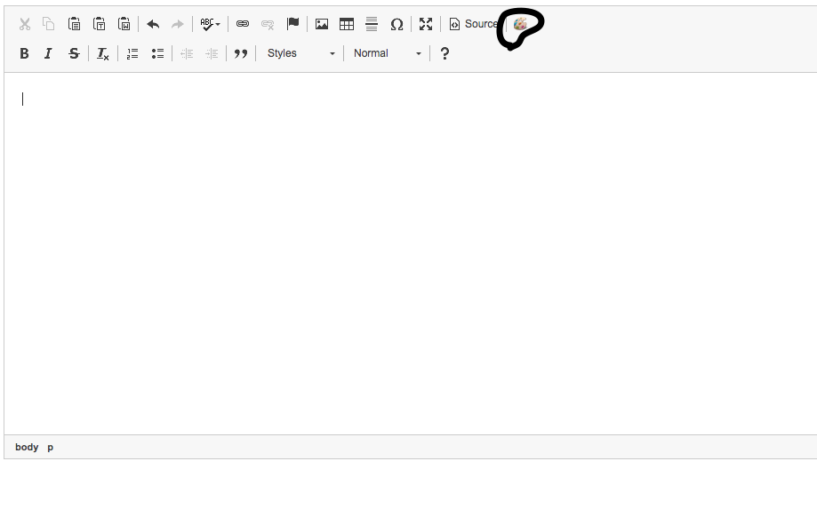
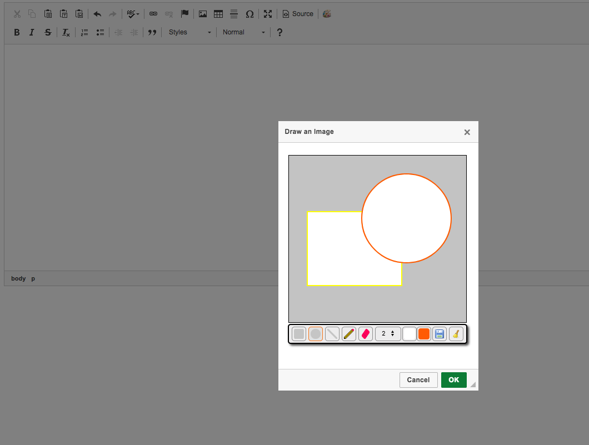
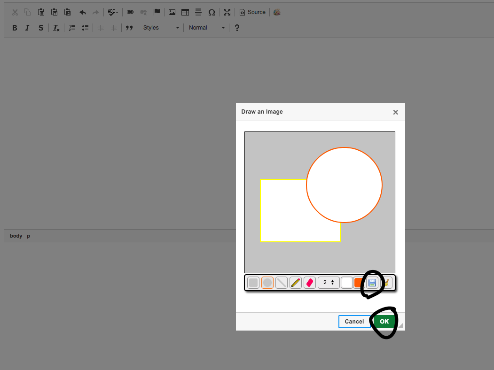
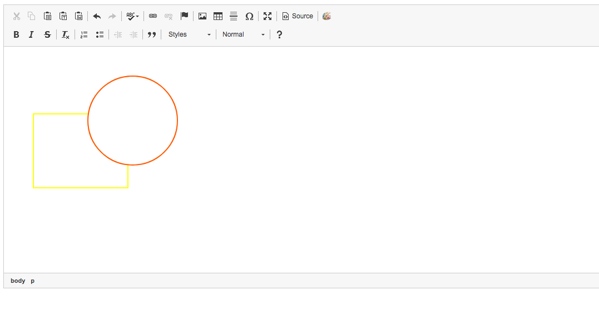

# PaintIt: A ckeditor plugin

Highly relies on wPaint.js : A jQuery paint plugin for a simple drawing surface that you can easily pop into your pages, similar to the basic windows paint program.

# Screenshots

Click on the icon that is added after integrating plugin.

Draw lovely painting, Put some nice colors and write randomly with pencil.

Click on save button then ok, or directly ok button.Both will work.

Hurray, you can see the output in your ckeditor element.

